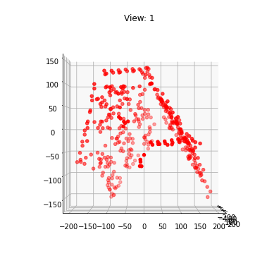
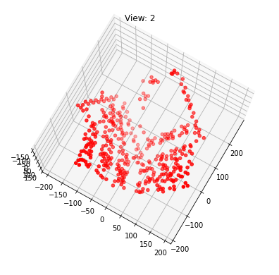
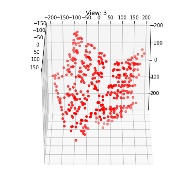
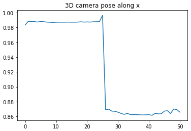
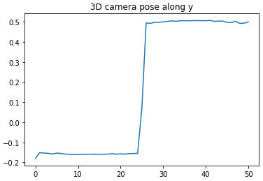
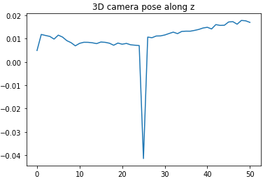

# Affine-Structure-From-Motion
A mobile observer samples sequences of narrow-field projections of configurations in ambient space. For rigid transformations, a unique metrical reconstruction is known to be possible from three orthographic views of four points. 

## Overview


This problem continues the interest point detection and tracking problem from HW2. Now, you will recover a 3D pointcloud from the image sequence hotel.seq0.png … hotel.seq50.png. You are encouraged to use your results from HW2, but in case you were not able to complete it, we have also included pre- computed intermediate results in the supplemental material. Submit your code so that we can reproduce your results.

The outline of the affine structure from motion algorithm:


## Results
<table>
    <tr>
        <td><p align='center'> View 1</p></td>
        <td><p align='center'> View 2</p></td>
    </tr>
        <tr>
        <td><p align='center'> View 3</p></td>
        <td><p align='center'> Camera translation along X-Axis</p></td>
    </tr>
        <tr>
        <td><p align='center'> Camera translation along Y-Axis</p></td>
        <td><p align='center'> Camera translation along Z-Axis</p></td>
    </tr>
</table>

## Folder Structure
```
📦Affine-Structure-From-Motion
 ┣ 📂Results
 ┃ ┣ 📜camX.png
 ┃ ┣ 📜camY.png
 ┃ ┣ 📜camZ.png
 ┃ ┣ 📜view1.png
 ┃ ┣ 📜view2.png
 ┃ ┗ 📜view3.png
 ┣ 📜.gitignore
 ┣ 📜Affine_SFM.ipynb
 ┣ 📜LICENSE
 ┗ 📜README.md
```
